# 🐇 Event-Driven Microservices with Spring Boot and RabbitMQ

A hands-on laboratory that implements an **event-driven architecture** using two independent
*Spring Boot* microservices communicating asynchronously through a **RabbitMQ** message broker,
orchestrated with **Docker Compose** and deployed on a live environment.

---

## 📋 Table of Contents

- [Project Description](#-project-description)
- [Architecture Overview](#️-architecture-overview)
- [Tech Stack](#️-tech-stack)
- [Project Structure](#-project-structure)
- [Prerequisites](#-prerequisites)
- [Setup & Execution](#-setup--execution)
  - [Phase 1 — Build & Test](#phase-1--build--test)
  - [Phase 2 — Publish Docker Images](#phase-2--publish-docker-images)
  - [Phase 3 — Deploy with Docker Compose](#phase-3--deploy-with-docker-compose)
  - [Phase 4 — Test the Event-Driven Flow](#phase-4--test-the-event-driven-flow)
  - [Phase 5 — RabbitMQ Management UI](#phase-5--rabbitmq-management-ui)
  - [Phase 6 — Multiple Messages](#phase-6--multiple-messages)
- [API Reference](#-api-reference)
- [Design Decisions](#️-design-decisions)
- [Author](#-author)
- [License](#-license)
- [Additional Resources](#-additional-resources)

---

## 📝 Project Description

**Course:** Arquitectura Centrada en el Negocio (ARCN_M)

This laboratory demonstrates the core principles of **event-driven architecture (EDA)**
through a minimal but production-quality system composed of two fully independent microservices:

- **Producer Service** — exposes a *RESTful API* that accepts messages via `HTTP POST`
  and publishes them to a **RabbitMQ** exchange using the *AMQP* protocol.
- **Consumer Service** — has no HTTP interface; it listens permanently to the RabbitMQ queue
  and processes every message that arrives asynchronously.

The key benefit of this design is **temporal decoupling**: the producer does not need to know
whether the consumer is running at the time of publishing. If the consumer is temporarily
unavailable, messages accumulate in the durable queue and are processed once it reconnects —
**no messages are lost**.

---

## 🏗️ Architecture Overview

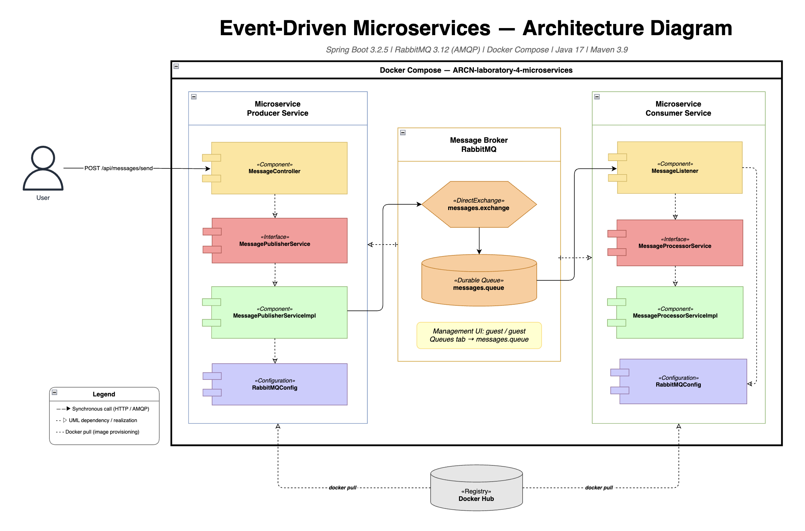

The end-to-end message flow is:

1. An **HTTP client** sends a `POST` request with a JSON body to the *Producer Service*.
2. The *Producer* validates the payload and publishes it to the **`messages.exchange`**
   (*DirectExchange*) with the routing key `messages.routing-key`.
3. **RabbitMQ** routes the message to the durable **`messages.queue`**.
4. The *Consumer Service* — listening via `@RabbitListener` — receives the message
   and delegates processing to `MessageProcessorService`.

All three services run inside a shared **Docker bridge network** (`event-network`),
allowing them to communicate by service name instead of IP address.

---

## 🛠️ Tech Stack

| Layer | Technology | Purpose |
|---|---|---|
| Language | **Java 17** | Core runtime for both microservices |
| Framework | **Spring Boot 3.2.5** | Application bootstrap, auto-configuration |
| Messaging | **RabbitMQ 3.12** (AMQP) | Message broker — *DirectExchange* + durable queue |
| Containerisation | **Docker** + **Docker Compose** | Image packaging and service orchestration |
| Build tool | **Apache Maven 3.9** | Dependency management, compilation, packaging |
| Boilerplate reduction | **Lombok** | `@Data`, `@Builder`, `@Slf4j`, `@RequiredArgsConstructor` |
| Validation | **Jakarta Validation** | Constraint enforcement on controller DTOs |
| Testing | **JUnit 5** + **Mockito** + **JaCoCo** | Unit tests, mocking, coverage reports |
| Image registry | **Docker Hub** | Public image storage for deployment |

---

## 📁 Project Structure

```
ARCN-laboratory-4-microservices/
│
├── .devcontainer/
│   └── devcontainer.json                  ← GitHub Codespaces configuration
│
├── assets/images/                         ← Evidence screenshots
│
├── producer-service/                      ← Microservice 1: REST API → RabbitMQ publisher
│   ├── src/main/java/com/eci/arcn/producer/
│   │   ├── ProducerApplication.java
│   │   ├── config/
│   │   │   └── RabbitMQConfig.java        ← Exchange, Queue & Binding beans
│   │   ├── controller/
│   │   │   └── MessageController.java     ← POST /api/messages/send
│   │   ├── dto/
│   │   │   ├── MessageRequestDto.java     ← Inbound payload (@NotBlank, @Size)
│   │   │   └── MessageResponseDto.java    ← Outbound confirmation
│   │   └── service/
│   │       ├── MessagePublisherService.java        ← Interface (DIP)
│   │       └── impl/MessagePublisherServiceImpl.java
│   ├── src/test/...                       ← 10 unit tests (service + controller)
│   ├── pom.xml
│   └── Dockerfile                         ← Multi-stage build (JDK → JRE)
│
├── consumer-service/                      ← Microservice 2: RabbitMQ listener
│   ├── src/main/java/com/eci/arcn/consumer/
│   │   ├── ConsumerApplication.java
│   │   ├── config/
│   │   │   └── RabbitMQConfig.java        ← Queue (durable=true) bean
│   │   ├── listener/
│   │   │   └── MessageListener.java       ← @RabbitListener entry point
│   │   └── service/
│   │       ├── MessageProcessorService.java        ← Interface (DIP)
│   │       └── impl/MessageProcessorServiceImpl.java
│   ├── src/test/...                       ← 9 unit tests (service + listener)
│   ├── pom.xml
│   └── Dockerfile                         ← Multi-stage build (JDK → JRE)
│
├── docker-compose.yml                     ← Full stack orchestration
├── architecture-diagram.xml               ← draw.io source diagram
├── CLAUDE.md                              ← Claude Code session context
└── README.md
```

---

## ✅ Prerequisites

- **Java 17** — verify with `java -version`
- **Maven 3.9+** — verify with `mvn --version`
- **Docker Desktop** — running and accessible via CLI (`docker info`)
- A [Docker Hub](https://hub.docker.com) account with a *Personal Access Token*

---

## 🚀 Setup & Execution

### Phase 1 — Build & Test

Run `mvn clean verify` for each service. This compiles the source, executes all unit tests,
and generates a **JaCoCo** coverage report under `target/site/jacoco/index.html`.

```bash
# Producer Service
cd producer-service
mvn clean verify
cd ..

# Consumer Service
cd consumer-service
mvn clean verify
cd ..
```

#### 📸 Producer — Tests Passing

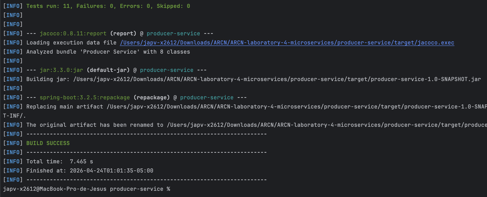

All **5 service tests** and **5 controller slice tests** pass.
The JaCoCo report confirms coverage above the **80 % minimum threshold**.

#### 📸 Consumer — Tests Passing


All **6 processor service tests** and **3 listener tests** pass with full coverage.

---

### Phase 2 — Publish Docker Images

#### Step 1 — Authenticate with Docker Hub

```bash
docker login -u <YOUR_DOCKER_HUB_USERNAME>
```

> Enter your **Personal Access Token** when prompted — do not use your account password.
> Generate one at *Docker Hub → Account Settings → Personal Access Tokens*.

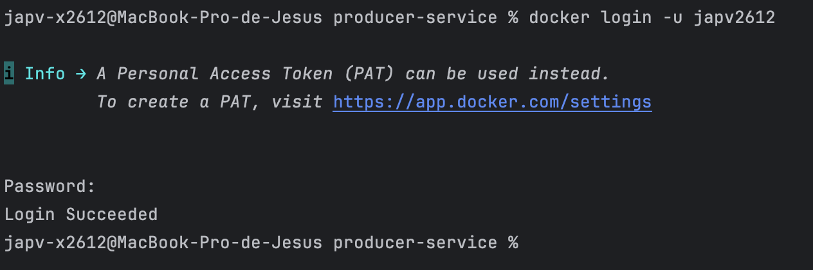

#### Step 2 — Build and push the Producer image

The Dockerfiles use a **multi-stage build**: *Maven* + *JDK 17* compiles the JAR in the
build stage; only the lightweight *JRE* runtime image is shipped to production —
no separate `mvn package` step is needed before `docker build`.

```bash
docker build -t <YOUR_DOCKER_HUB_USERNAME>/producer-service:latest ./producer-service
docker push <YOUR_DOCKER_HUB_USERNAME>/producer-service:latest
```

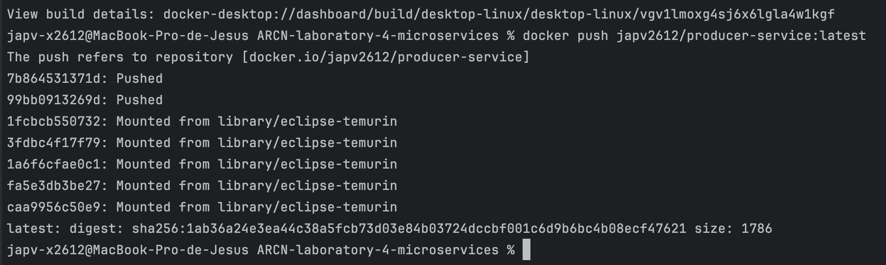

#### Step 3 — Build and push the Consumer image

```bash
docker build -t <YOUR_DOCKER_HUB_USERNAME>/consumer-service:latest ./consumer-service
docker push <YOUR_DOCKER_HUB_USERNAME>/consumer-service:latest
```

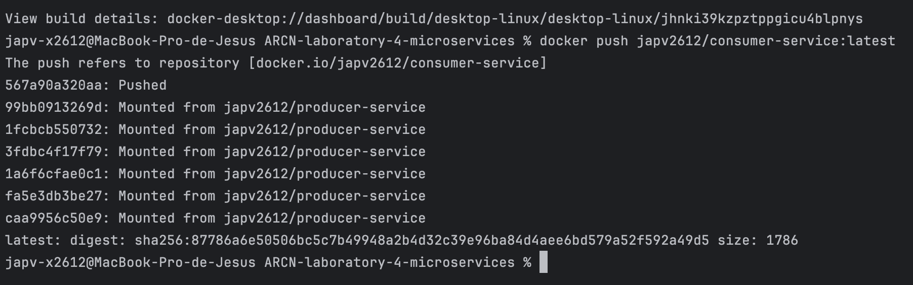

#### Step 4 — Verify both repositories on Docker Hub

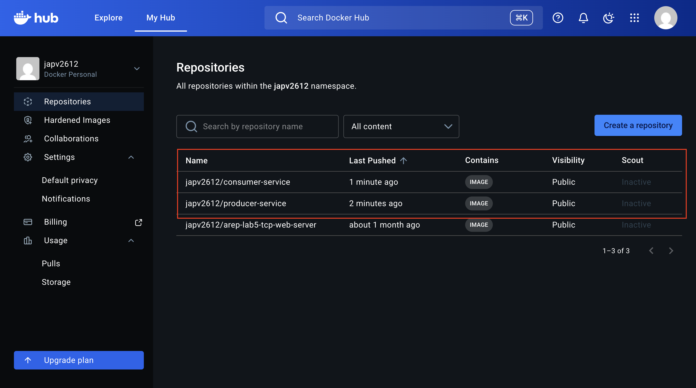

Both `producer-service` and `consumer-service` repositories should appear with the `latest` tag.

---

### Phase 3 — Deploy with Docker Compose

Replace `<YOUR_DOCKER_HUB_USERNAME>` in `docker-compose.yml` with your actual username,
then start the full stack:

```bash
docker-compose up -d
```

Docker Compose starts three services in the correct order:

1. **`rabbitmq`** — starts first; `depends_on: condition: service_healthy` ensures it is
   fully ready before the other services attempt to connect.
2. **`producer-service`** — starts after RabbitMQ is healthy.
3. **`consumer-service`** — starts after RabbitMQ is healthy.

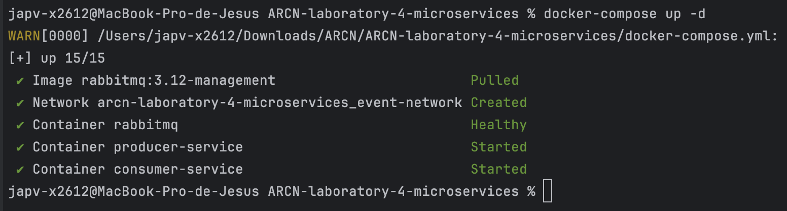

#### 📸 Docker Desktop — All Containers Running

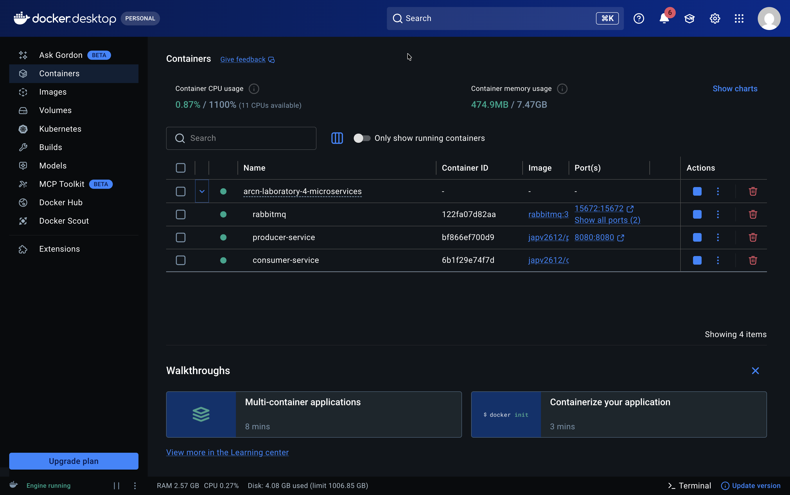

#### 📸 Container Status

```bash
docker-compose ps
```

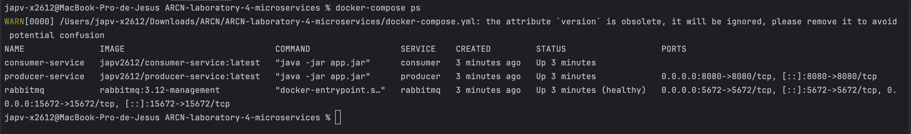

All three containers must show status **`Up`** before proceeding.

---

### Phase 4 — Test the Event-Driven Flow

#### Send a message to the Producer API

```bash
curl -s -X POST "http://localhost:8080/api/messages/send" \
  -H "Content-Type: application/json" \
  -d '{"content":"Hello from local Docker"}'
```

**Expected response:**

```json
{
  "message": "Hello from local Docker",
  "status": "SENT",
  "timestamp": "2026-04-24T10:00:00"
}
```

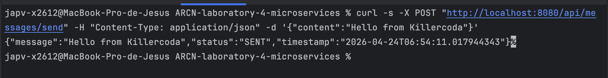

#### Verify the Consumer processed the message

```bash
docker-compose logs consumer
```

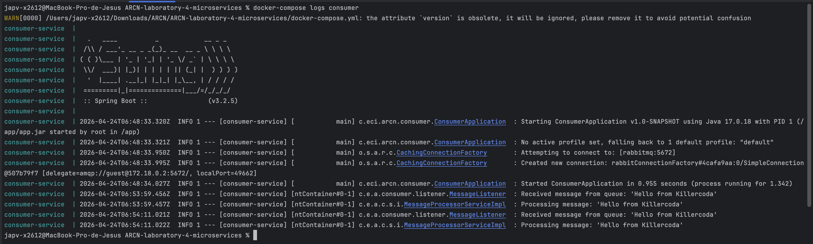

The consumer logs must show:

```
Received message from queue: 'Hello from local Docker'
Processing message: 'Hello from local Docker'
```

---

### Phase 5 — RabbitMQ Management UI

Open `http://localhost:15672` in your browser and log in with `guest` / `guest`.

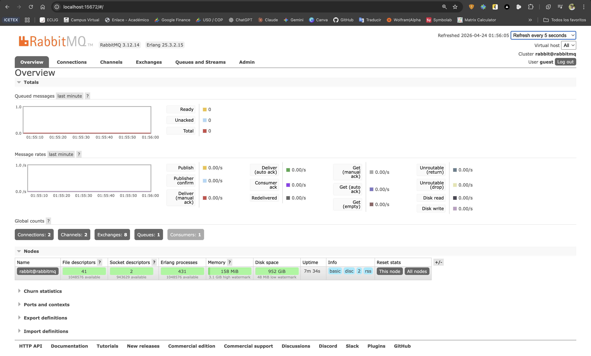

Navigate to **Queues → `messages.queue`** to inspect the queue metrics,
message rates, and the active consumer connection.

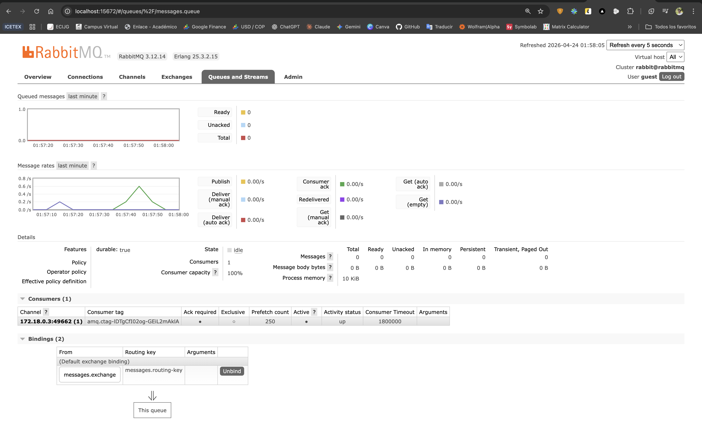

After all messages are consumed the **Ready** count returns to **0**,
confirming successful end-to-end delivery.

---

### Phase 6 — Multiple Messages

Send three messages in sequence to verify throughput and ordering:

```bash
for msg in "First" "Second" "Third"; do
  curl -s -X POST "http://localhost:8080/api/messages/send" \
    -H "Content-Type: application/json" \
    -d "{\"content\":\"$msg message\"}"
  echo
done
```

Then inspect the consumer logs:

```bash
docker-compose logs consumer --tail 20
```

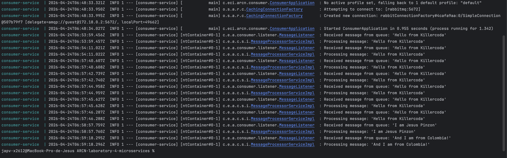

All three messages must appear processed **in order** in the consumer output.

#### Tear down

```bash
docker-compose down
```

---

## 📡 API Reference

### Producer Service — `http://localhost:8080`

#### `POST /api/messages/send`

Publishes a message to the RabbitMQ exchange.

**Request body**

```json
{
  "content": "Your message here"
}
```

| Field | Type | Constraints |
|---|---|---|
| `content` | `String` | **Required** · Not blank · Max **500 characters** |

**Response `200 OK`**

```json
{
  "message": "Your message here",
  "status": "SENT",
  "timestamp": "2026-04-24T10:00:00.123"
}
```

**Error responses**

| Status | Cause |
|---|---|
| `400 Bad Request` | `content` is blank, null, or exceeds 500 characters |

---

## 🏛️ Design Decisions

| Decision | Principle Applied |
|---|---|
| `MessagePublisherService` and `MessageProcessorService` interfaces | **DIP** (SOLID) — controllers and listeners depend on abstractions, never on `*Impl` classes |
| `MessageRequestDto` + `MessageResponseDto` | **SRP** — HTTP contract is decoupled from the messaging domain |
| `@Value` properties with `${ENV_VAR:default}` syntax | Externalised configuration — same image runs locally and in Docker with no code changes |
| `depends_on: condition: service_healthy` in Docker Compose | Guarantees *RabbitMQ* is fully ready before services attempt AMQP connections |
| Multi-stage *Dockerfiles* (build → runtime) | Smaller production images — *JDK* is not shipped to the final container |
| `CopyOnWriteArrayList` in `MessageProcessorServiceImpl` | Thread-safety — multiple *AMQP* listener threads may deliver messages concurrently |
| `@MockBean(ConnectionFactory.class)` in context load tests | Isolates Spring Boot smoke tests from infrastructure — no live broker required |

---

## 👥 **Author**

<table>
  <tr>
    <td align="center">
      <a href="https://github.com/JAPV-X2612">
        
        <br />
        <sub><b>Jesús Alfonso Pinzón Vega</b></sub>
      </a>
      <br />
      <sub>Full Stack Developer</sub>
    </td>
  </tr>
</table>

---

## 📄 License

This project is licensed under the **Apache License, Version 2.0, January 2004**.  
See the [LICENSE](LICENSE) file for the full terms and conditions.

---

## 🔗 **Additional Resources**

- [Spring Boot Reference Documentation](https://docs.spring.io/spring-boot/docs/3.2.5/reference/html/)
- [Spring AMQP — Reference Guide](https://docs.spring.io/spring-amqp/docs/current/reference/html/)
- [RabbitMQ — Official Documentation](https://www.rabbitmq.com/docs)
- [RabbitMQ — AMQP Concepts](https://www.rabbitmq.com/tutorials/amqp-concepts)
- [Docker — Multi-stage Builds](https://docs.docker.com/build/building/multi-stage/)
- [Docker Compose — Healthcheck Reference](https://docs.docker.com/compose/compose-file/05-services/#healthcheck)
- [Docker Hub — Official Registry](https://hub.docker.com)
- [Project Lombok — Official Site](https://projectlombok.org)
- [Jakarta Bean Validation — Specification](https://beanvalidation.org/3.0/)
- [JUnit 5 — User Guide](https://junit.org/junit5/docs/current/user-guide/)
- [Mockito — Documentation](https://site.mockito.org)
- [JaCoCo — Java Code Coverage Library](https://www.jacoco.org/jacoco/trunk/doc/)
- [Killercoda — Ubuntu Playground](https://killercoda.com/playgrounds/scenario/ubuntu)
- [draw.io — Architecture Diagrams](https://app.diagrams.net)
